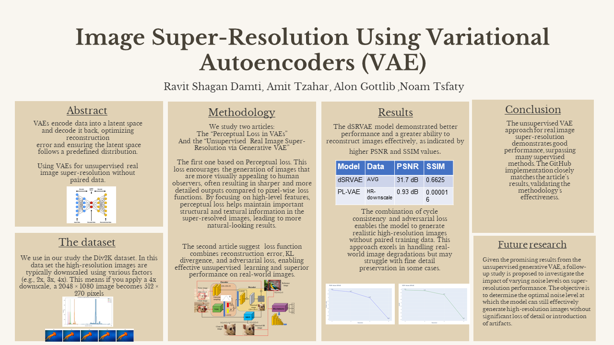

# Image Super-Resolution Using Variational Autoencoders (VAE)
Amit Tzahar
Noam Tsfaty
Alon Gotlib
Ravit Shagan Damti

# Introduction
 Variational AutoEncoders (VAEs) represent a class of generative models that employ a probabilistic framework to encode input data into a latent space and subsequently decode it to synthesize new data. In the context of image super-resolution, VAEs are designed to map low-resolution images into a latent space that encapsulates crucial details, thereby facilitating the generation of high-resolution images. This approach enables VAEs to infer and reconstruct missing information, making them particularly effective in enhancing both the resolution and quality of images.
 
# Dependencies
    Python > 3.0
    OpenCV library
    Pytorch > 1.0
    NVIDIA GPU + CUDA
    pytorch-gan-metrics


# Implementation: Perceptual Loss Approach:
the original code is in the following link:
https://github.com/nujitha99/PerceptualLossVAE/tree/main
## 1. Download the dataset
download the desired photos from the DIV2K dataset
the link in the Dataset section
## 2. Train
train the model on the original dataset
## 3. Finetune
use the saved model from the training 
finetune the model using the DIV2K model

# Unsupervised Generative Approach:
## 1. Download pre-trained models 
use this link to download the models:
https://drive.google.com/open?id=1SUZGE04vw5_yDYiw6PJ4sbHAOIEV6TJ7
copy them to the folder - models
## 2. Test
---------------------------------------
Create a folder named "Test" and "Result" and copy the test images to Test.
run: 
```sh
$ python test.py
```
The SR images will be created in the folder "Result"
# Dataset
The dataset chosen for this project is DIV2K
It can be downloaded from here
https://data.vision.ee.ethz.ch/cvl/DIV2K/

# Our poster

